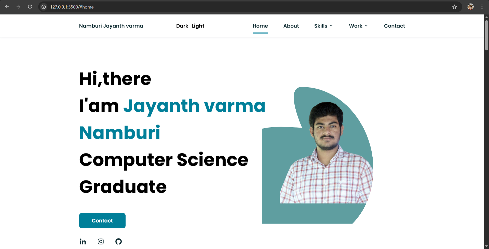
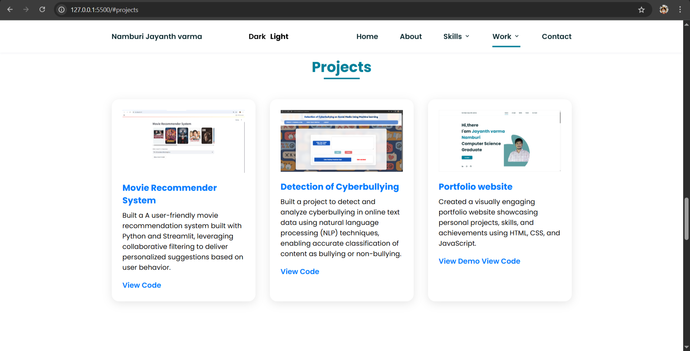
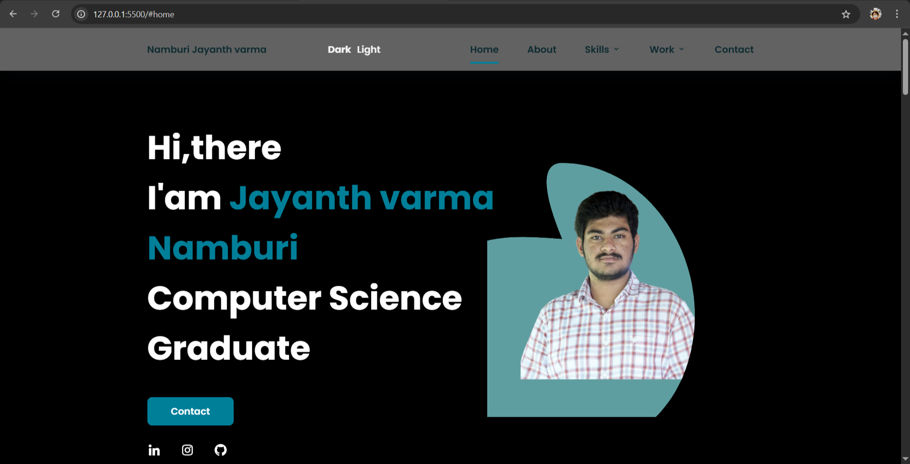

# Jayanth Varma's Portfolio

This repository contains the code for my personal portfolio website.  It showcases my skills, projects, and experience in computer science and software development.

## Features

*   **Responsive Design:**  Adapts seamlessly to different screen sizes (desktop, tablet, mobile).
*   **Dynamic Theme Toggling:**  Switch between light and dark modes for optimal viewing experience.
*   **Interactive Project Showcase:**  Clear and concise descriptions of my projects with links to code repositories.
*   **Detailed Skills Section:**  Highlights my proficiency in various programming languages and technologies.
*   **Easy Contact:**  Direct links to my social media profiles and a contact form for inquiries.

## Technologies Used

*   HTML5
*   CSS3
*   JavaScript
*   Boxicons (for icons)
*   ScrollReveal (for animations)

## Project Structure

*   `index.html`: Main HTML file.
*   `assets/css/styles.css`:  Stylesheet for the website.
*   `assets/js/main.js`: JavaScript file for interactivity.
*   `assets/img`: Folder containing images used on the website.

## Sample Images

  *Homepage Screenshot*

 *Projects Section Screenshot*

 *Dark Mode Screenshot*


## How to Run Locally

1.  Clone the repository:
    ```bash
    git clone https://github.com/Jayanth1560/Portfolio-Jay.git
    ```
2.  Open `index.html` in your web browser.


## Contact

*   [LinkedIn](https://www.linkedin.com/in/jayanth-varma-namburi)
*   [GitHub](https://github.com/Jayanth1560)

